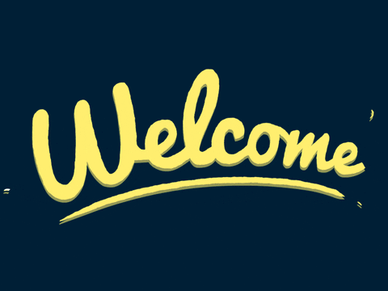
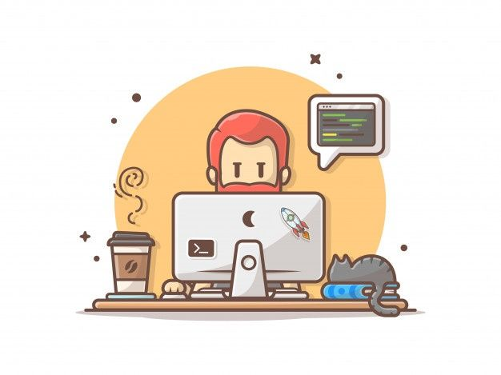

# Hello there👋

## Vedansh here🙋🏻‍♂️
## Here is something you should know about me😄
I'm a Sophomore🎓 pursuing Computer-Science-Engineering from SRMIST,KTR.I'm a result-driven self motivated student who aims to solve real-world problems using fast and efficient ML Models.I love❤ to learn about new developments in technology and ways to implement them.I love solving complex problems in C++ and Python using effective algorithms.Reading books ,Listening to music ,Watching & Playing Football are some of my hobbies.

🔭 I’m currently doing contributions in an opensource event HakinCodes'20

🌱 I’m currently learning Deep Learning & Computer Vision.

 

<!--

  

  

                 
  

 

<!--
**vvHacker007/vvHacker007** is a ✨ _special_ ✨ repository because its `README.md` (this file) appears on your GitHub profile.

Here are some ideas to get you started:

- 
- 
- 👯 I’m looking to collaborate on ...
- 🤔 I’m looking for help with ...
- 💬 Ask me about ...
- 📫 How to reach me: ...
- 😄 Pronouns: ...
- ⚡ Fun fact: ...
-->
